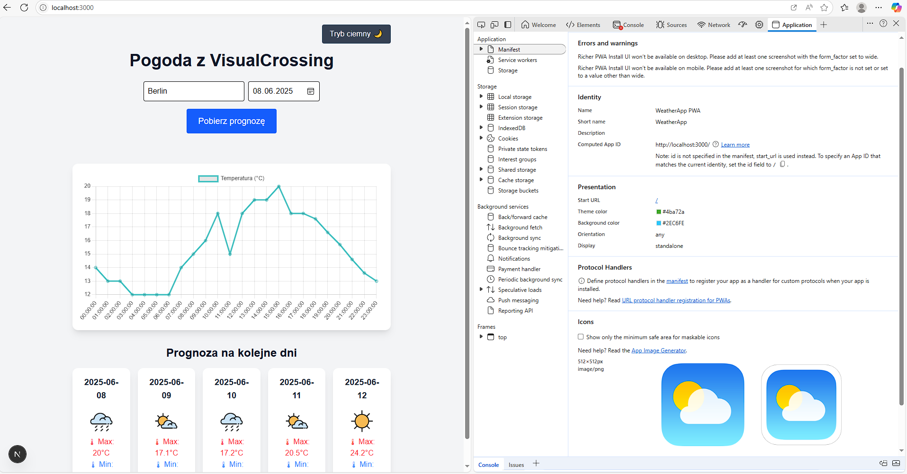

This is a [Next.js](https://nextjs.org) project bootstrapped with [`create-next-app`](https://nextjs.org/docs/app/api-reference/cli/create-next-app).

## Getting Started

Follow instruction to install Node.js and npm
```
https://docs.npmjs.com/downloading-and-installing-node-js-and-npm
```

Install next

```
npm install next
```

This application uses VisualCrossing Weather API. Create
```
.env.local
```
file and set variable (exemplary token is already hardcoded in Weather.tsx)
```
NEXT_PUBLIC_VISUALCROSSING_API_KEY=
```
to your personal VisualCrossing API key (see Getting API key section below)

## Running the application

Then, run the development server:

```bash
npm run dev
# or
yarn dev
# or
pnpm dev
# or
bun dev
```

Open [http://localhost:3000](http://localhost:3000) with your browser to see the result.

## PWA



Install app using (icon may vary between browsers):


You can also pin it to taskbar


## Getting API key 

Sign in to 
```
https://www.visualcrossing.com/
```
After that your API key can be found in account details

